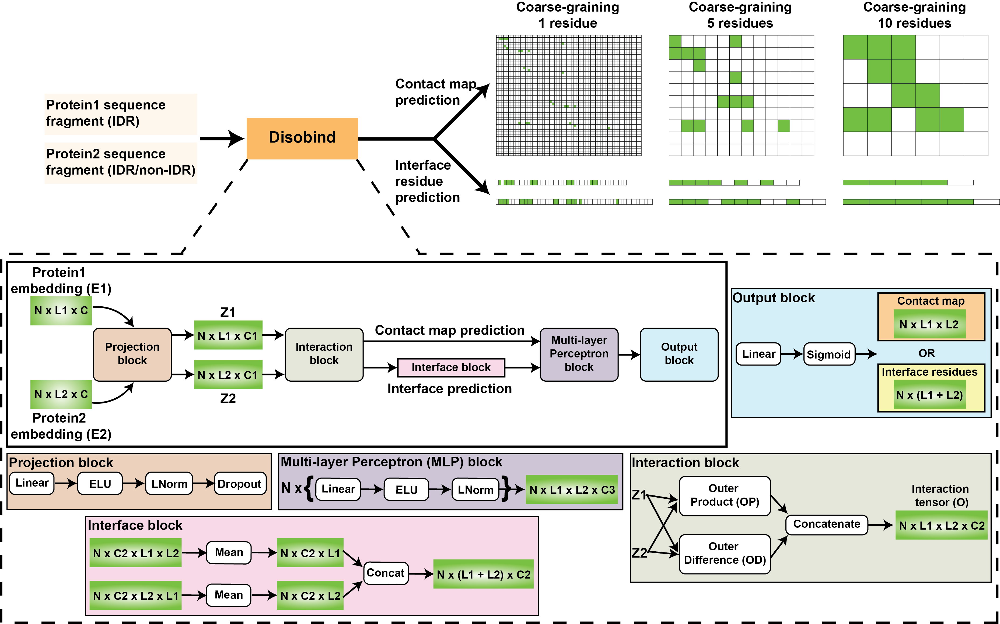

# Disobind
Disobind is a deep learning method for predicting inter-protein contact maps and interface residues for an IDR and its binding partner from their sequences. 



## Publication and Data
* Kartik Majila, Varun Ullanat, Shruthi Viswanath. **A deep learning method for predicting interactions for intrinsically disordered regions of proteins.** bioRxiv, [DOI](https://www.biorxiv.org/content/10.1101/2024.12.19.629373v5).
* Data is deposited in [Zenodo](https://www.doi.org/10.5281/zenodo.14504762)

## Colab Notebook
A Google Colab notebook for running Disobind+ColabFold is available [here](https://colab.research.google.com/drive/13EOqRV9sMwDLm0EEsFirFlXDHquSK4hF?usp=sharing).

## Installation 

### Dependencies
* See `requirements.txt` for Python dependencies.

### Steps for installation 

1. Install Conda  
If not already installed, install Conda as specified here: https://docs.conda.io/projects/conda/en/latest/index.html.

2. Clone the repository
```
git clone https://github.com/isblab/disobind.git
```

3. Set up the repository  

Run the following commands in order:
```
cd disobind/
chmod +x install.sh
./install.sh
```

For using GPUs, ensure CUDA-toolkit (version 11.8) and the NVIDIA drivers are installed on the system.

## Running Disobind + AF2  

### Input requirements
1. Disobind can only be used for binary complexes (AB). However, for non-binary complexes (ABC) the user can convert them into binary pairs (AB, BC, AC) to run Disobind.  
2. The input protein pair is assumed to be interacting and Disobind predicts where they interact (contact maps and interface residues).  
3. Protein 1 must be an IDR whereas Protein 2 may or may not be an IDR.  

### Prediction
The input is a CSV file.

Each row corresponds to one sequence fragment pair for which the Disobind prediction is required. 

Each row contains the UniProt ID, start, and end UniProt residue positions for each of the two protein sequence fragments.  

To run a Disobind prediction only, provide the input as:  
`UniProt_ID1, start1, end1, UniProt_ID2, start2, end2`.

To run a Disobind+AF2 prediction, provide the input as:  
`UniProt_ID1, start1, end1, UniProt_ID2, start2, end2, AF2_struct_file_path, AF2_pae_file_path, chain1, chain2, offset1, offset2`.

`Chain1, Chain2` represent the Chain IDs that correspond to the protein1/2 sequence fragment.
`Offset1, Offset2` are integer values that indicate the difference in the residue positions between the AF2 structure and UniProt position.  
Set the offsets to 0 if the AF2 structure corresponds to the full UniProt sequence or just the sequence fragment.

As an example see `example/test.csv`.  

Run the following command to use Disobind for the example case with default settings:

```
python run_disobind.py -f ./example/test.csv 
```

By default, Disobind provides interface predictions at a coarse-grained (CG) resolution 1.  

#### Other options
| Flags  |                                     Description                                                                           |
| ------ | --------------------------------------------------------------------------------------------------------------------------|
| -f     | path to the input csv file.                                                                                               |
| -c     | no. of cores to be used for downloading the UniProt sequences (default = 2).                                              |
| -o     | output directory name (default: `output`).                                                                                |
| -d     | device to be used - cpu/cuda (default: `cpu`).                                                                            |
| -cm    | whether to predict inter-protein contact maps (default: `False`). By default, only interface residues are predicted.      |
| -cg    | coarse-grained resolution - 0, 1, 5, 10 (default: `1`). If `0`, predictions at all resolutions (1,5 and 10) are provided. |

This script outputs the following files:  

* A CSV output file for all predictions for all input sequence fragment pairs. See the Colab notebook for description of the output CSV. 

* `Predictions.npy`: contains predictions for all input sequence fragment pairs in a nested dictionary.

### Description of the output

The output CSV file contains the following four columns:

| Protein1 | Residue1 | Protein2 | Residue2 |
|:-------:|:--------:|:--------:|:---------:|
| X1      |  10      | X2       | 40        |
| X1      |  14      | X2       | 44        |
| X1      |  125     | X2       | 80        |

For __contact map__ prediction, this must be interpreted as, residue 10 in protein X1 interacts with residue 40 in protein X2 and so on.

For __interface__ residue prediction, this must be interpreted as, residues 10, 14, and 125 in protein X1 may interact with one or more of the residues 40, 44, and 80 in protein X2.

## Instructions for reproducing/re-training Disobind

### Dataset creation
Follow the steps as specified in [dataset](./dataset/README.md).  

### Model training
Follow the steps as specified in [src](./src/README.md).  

### Analysis of the model outputs
Follow the steps as specified in [analysis](./analysis/README.md).  
   
## Information
__Author(s):__ Kartik Majila, Varun Ullanat, Shruthi Viswanath

__Date__: Jan 10, 2026

__License:__ [CC BY-SA 4.0](https://creativecommons.org/licenses/by-sa/4.0/)
This work is licensed under the Creative Commons Attribution-ShareAlike 4.0
International License.

__Testable:__ Yes

__Parallelizeable:__ Yes

__Publications:__  Majila K., Ullanat V., Viswanath S. A deep learning method for predicting interactions for intrinsically disordered regions of proteins. bioRxiv  (2024), [DOI](https://www.biorxiv.org/content/10.1101/2024.12.19.629373v5).
